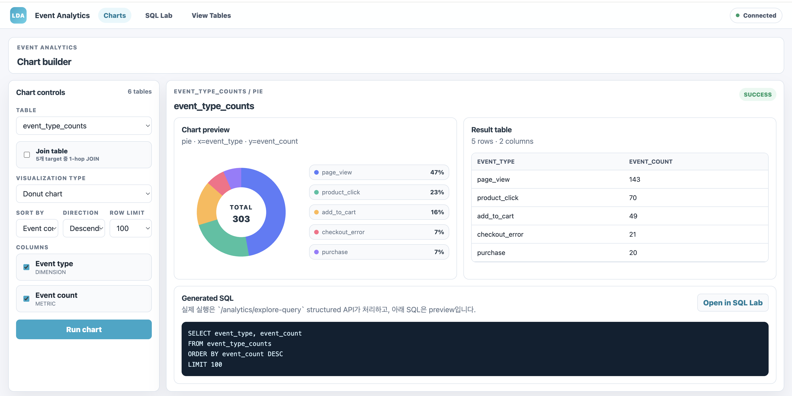
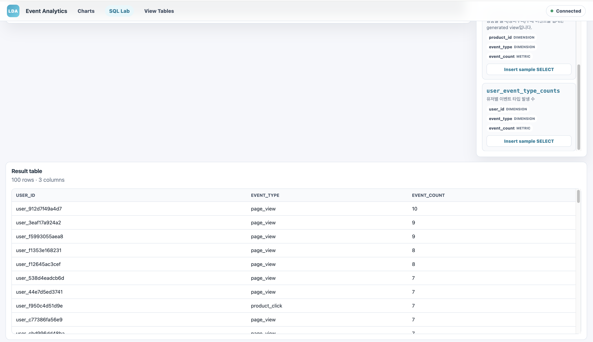
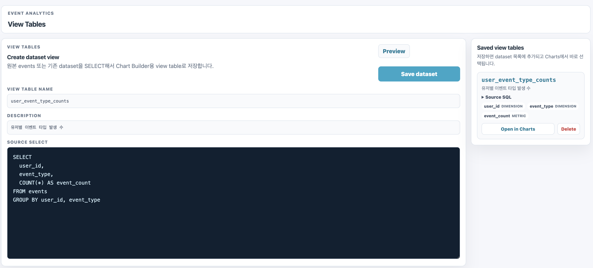
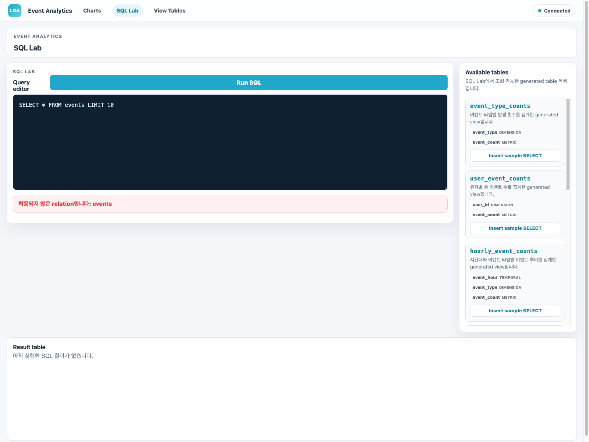

# live_data_architecture

커머스 웹 서비스에서 발생하는 사용자 행동 이벤트를 생성하고, Redis Streams를 거쳐 PostgreSQL에 저장한 뒤, SQL 집계 결과를 Next.js 화면에서 확인하는 작은 이벤트 분석 파이프라인입니다.

```text
event_generator
  -> Redis Streams(web.events.raw.v1)
  -> FastAPI consumer
  -> PostgreSQL events table
  -> Analytics API
  -> Next.js Charts / SQL Lab / View Tables
```

## 1. 실행 방법

### 필요한 도구

- Docker Desktop
- Docker Compose v2
- Git

로컬에서 직접 개발할 때만 아래가 추가로 필요합니다.

- Python 3.12
- uv
- Node.js / npm

### Docker로 전체 실행

```bash
cp .env.example .env
docker compose up --build
```

실행 후 접속 위치는 아래와 같습니다.

| 대상 | 주소 |
|---|---|
| Frontend | `http://localhost:3000` |
| Backend health | `http://localhost:8000/health/ready` |
| Analytics datasets | `http://localhost:8000/analytics/datasets` |
| PostgreSQL host port | `15432` |
| Redis host port | `16379` |

`docker compose up --build`를 실행하면 `event-generator`도 함께 실행되어 Redis Streams로 이벤트를 계속 전송합니다.
데모용으로 유한 개수만 추가 생성하고 싶으면 아래 명령을 사용할 수 있습니다.

```bash
docker compose run --rm event-generator \
  .venv/bin/python -m event_generator \
  --sink redis --producer-id producer_demo \
  --max-events 25 --seed 20260425 --no-sleep
```

## 2. 요구사항 체크리스트

| 과제 단계 | 구현 내용 | 위치 |
|---|---|---|
| Step 1. 이벤트 생성기 | Python 기반 독립 producer가 랜덤 웹 이벤트 생성 | `event_generator/` |
| Step 2. 로그 저장 | Redis Streams를 거쳐 PostgreSQL `events` table에 컬럼 분리 저장 | `backend/app/event_analytics/`, `backend/alembic/` |
| Step 3. 데이터 집계 분석 | 이벤트 타입별 수, 유저별 수, 시간대별 수, 에러 비율, 퍼널 집계 제공 | `GET /analytics/datasets`, `POST /analytics/query` |
| Step 4. Docker 실행 | app + DB + Redis + event generator + frontend 전체 실행 | `docker-compose.yml` |
| Step 5. 결과 시각화 | SQL 결과를 table/chart로 확인하고, view table을 저장해 chart dataset으로 사용 | `frontend/` |

## 3. 이벤트 생성기 설계

이벤트 생성기는 커머스 웹 서비스에서 사용자가 상품을 발견하고 구매하거나 결제 오류를 만나는 흐름을 표현합니다.

| 이벤트 타입 | 의미 | 분석 목적 |
|---|---|---|
| `page_view` | 페이지 조회 | 전체 트래픽과 인기 페이지 확인 |
| `product_click` | 상품 클릭 | 상품 관심도 확인 |
| `add_to_cart` | 장바구니 담기 | 구매 의도 확인 |
| `purchase` | 구매 완료 | 전환과 매출 확인 |
| `checkout_error` | 결제 오류 | 결제 실패 원인 확인 |

사용자, 상품, 페이지 경로는 seed 기반 Faker 데이터로 생성합니다. 같은 seed를 쓰면 재현 가능한 데이터를 얻을 수 있고, seed를 생략하면 실행마다 다른 이벤트 ID가 생성됩니다.

```bash
python -m event_generator --max-events 10 --seed 20260424 --no-sleep
```

주요 옵션은 아래와 같습니다.

| 옵션 | 설명 |
|---|---|
| `--sink stdout` | JSON Lines를 stdout으로 출력 |
| `--sink redis` | Redis Streams에 이벤트 전송 |
| `--max-events` | 생성할 이벤트 수. 생략하면 계속 생성 |
| `--seed` | 재현 가능한 랜덤 생성을 위한 seed |
| `--no-sleep` | 테스트용으로 대기 없이 빠르게 생성 |

## 4. 로그 저장소와 스키마

최종 저장소는 PostgreSQL입니다. Redis Streams는 producer와 consumer 사이의 MQ 역할만 담당합니다.

```text
event_generator --sink redis
  -> Redis Streams web.events.raw.v1
  -> FastAPI background consumer
  -> PostgreSQL events table
```

PostgreSQL을 선택한 이유는 다음과 같습니다.

- JSON 전체를 그대로 저장하지 않고 필드별 컬럼으로 분리할 수 있습니다.
- 이벤트 타입별, 유저별, 시간대별 집계를 SQL로 바로 실행할 수 있습니다.
- Docker Compose에서 app + DB 구성이 단순합니다.
- `event_id` primary key와 batch insert conflict-ignore로 중복 전달에 대응할 수 있습니다.

저장 테이블은 아래처럼 구성했습니다.

```sql
CREATE TABLE events (
  event_id TEXT PRIMARY KEY,
  schema_version TEXT NOT NULL,
  event_type TEXT NOT NULL,
  occurred_at TIMESTAMPTZ NOT NULL,
  user_id TEXT NOT NULL,
  traffic_phase TEXT NOT NULL,
  producer_id TEXT NOT NULL,
  page_path TEXT NULL,
  category_id TEXT NULL,
  product_id TEXT NULL,
  amount NUMERIC(12, 2) NULL,
  currency TEXT NULL,
  error_code TEXT NULL,
  error_message TEXT NULL,
  ingested_at TIMESTAMPTZ NOT NULL DEFAULT now()
);
```

공통 필드는 모든 이벤트에 항상 저장하고, 이벤트 타입마다 필요한 상세 필드는 nullable column으로 두었습니다. 이렇게 하면 하나의 테이블에서 전체 이벤트를 분석하면서도 구매 금액, 상품, 에러 정보 같은 타입별 분석 축을 잃지 않습니다.

## 5. 집계 분석

분석 UI와 SQL Lab은 raw `events` table을 직접 조회하지 않고, 아래 generated view 또는 사용자가 저장한 view table을 조회합니다.

| Dataset | 목적 |
|---|---|
| `event_type_counts` | 이벤트 타입별 발생 횟수 |
| `user_event_counts` | 유저별 총 이벤트 수 |
| `hourly_event_counts` | 시간대별 이벤트 추이 |
| `error_event_ratio` | 에러 이벤트 비율 |
| `commerce_funnel_counts` | 커머스 퍼널 단계별 수 |
| `product_event_counts` | 상품별 이벤트 수 |

예시 SQL입니다.

```sql
SELECT event_type, event_count
FROM event_type_counts
ORDER BY event_count DESC;
```

```sql
SELECT user_id, event_count
FROM user_event_counts
ORDER BY event_count DESC
LIMIT 20;
```

```sql
SELECT event_hour, event_type, event_count
FROM hourly_event_counts
ORDER BY event_hour, event_type;
```

SQL Lab은 직접 SELECT를 입력할 수 있지만, 서버에서 아래 정책으로 제한합니다.

- `SELECT` 단일 statement만 허용
- DDL/DML 차단
- raw `events` table 직접 조회 차단
- generated view와 saved view table만 조회 허용
- `pg_sleep`, `pg_catalog`, `information_schema` 등 위험 함수/카탈로그 차단
- row limit, read-only transaction, statement timeout 적용

## 6. 시각화

Frontend는 Next.js(TypeScript)로 작성했습니다.

```bash
cd frontend
npm install
npm run dev
```

화면은 세 가지로 단순화했습니다.

| 화면 | 역할 |
|---|---|
| Charts | Dataset, column, chart type을 선택해 chart/table 확인 |
| SQL Lab | 직접 SELECT를 입력하고 결과 table 확인 |
| View Tables | SELECT를 preview한 뒤 분석용 view table로 저장 |

지원하는 chart preview는 `bar`, `line`, `pie`, `metric`, `table`입니다.
복잡한 dashboard 저장, 인증, query history, 외부 DB connection 관리는 이번 과제 범위에서 제외했습니다.

## 7. 구현하면서 고민한 점

첫 번째 고민은 이벤트 생성기를 FastAPI 안에 넣을지, 독립 producer로 둘지였습니다. 과제는 “이벤트를 생성하고 저장하는 파이프라인”이 목적이므로, 실제 서비스처럼 이벤트 발생 주체를 backend API와 분리하는 쪽을 선택했습니다.

두 번째 고민은 producer가 DB에 직접 저장할지 MQ를 거칠지였습니다. 실시간 이벤트를 한 건씩 DB에 바로 쓰면 부하와 장애 전파가 커질 수 있어 Redis Streams를 MQ로 두고, consumer가 batch insert 후 ack하는 구조로 만들었습니다.

세 번째 고민은 SQL 입력 UI의 안전성이었습니다. Superset처럼 raw SQL 입력 경험은 유지하되, 모든 relation을 allowlist로 제한하고 read-only DB role, timeout, row limit을 적용했습니다. 완전한 분석 플랫폼을 만들기보다는 과제에 필요한 SQL 집계와 시각화에 집중했습니다.

## 8. 제출용 스크린샷 위치

실제 제출 시 아래 경로에 스크린샷을 저장하면 됩니다.

| 파일 | 캡처 대상 |
|---|---|
| `docs/screenshots/01_health_ready.png` | `/health/ready` 결과 |
| `docs/screenshots/02_event_ingest.png` | 이벤트 생성 후 Redis/DB 적재 확인 |
| `docs/screenshots/03_charts_builder.png` | Charts 화면 |
| `docs/screenshots/04_sql_lab_table.png` | SQL Lab 결과 table |
| `docs/screenshots/05_view_tables.png` | View Tables preview/save 화면 |
| `docs/screenshots/06_sql_guardrail_rejection.png` | 위험 SQL 거부 예시 |

현재 반영된 스크린샷은 아래와 같습니다.

### Charts



### SQL Lab



### View Tables



### SQL Guardrail rejection



## 9. 검증 명령

```bash
make ci
make frontend-ci
cd frontend && npm audit --omit=dev --audit-level=moderate
UV_PROJECT_ENVIRONMENT=../.venv uvx bandit -r backend/app event_generator -x backend/tests,event_generator/tests -q
docker compose config --quiet
git diff --check
```

## 10. 설계 문서

로그/스키마/드레인 설계 의도는 아래 문서에 정리했습니다.

- [JSON log design](docs/log_design/json_log.md)
- [Schemas design](docs/log_design/schemas.md)
- [Drain design](docs/log_design/drain.md)
- [Generator log design](docs/log_design/gernerator_log.md)

상세 개발 이력은 `docs/` 아래에 정리했습니다.
